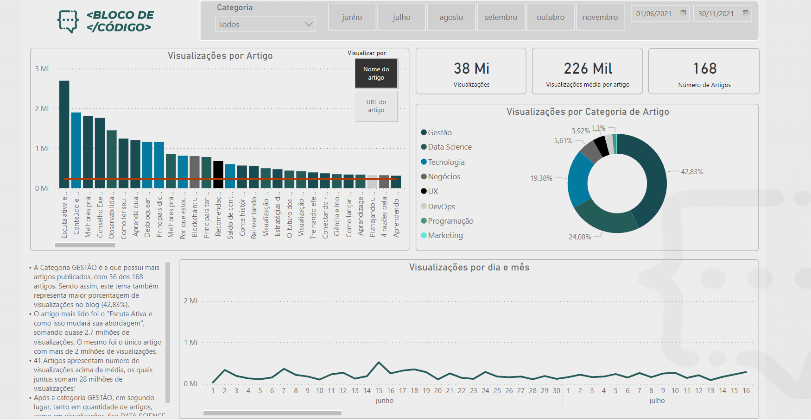

# BLOCO DE CODIGO
Projeto de DataViz para analisar trafego no Blog "Bloco de Código" no segundo semestre de 2021. O dashboard foi desenvolvido no Power BI, com o objetivo de avaliar o efeito de anúncios pagos direcionados para visualização e acessos do site. 

[Dados](campanha_bloco_de_código.xlsx) utilizados, fornecidos pela empresa.

[Arquivo](Bloco_de_Codigo.pbix) editável do Power BI.

Acesso ao dashboard completo [aqui](https://app.powerbi.com/view?r=eyJrIjoiZDliOGY1MmYtYzZjNy00ZmY5LWFjZGEtNjFlNWE4YTBkZDVmIiwidCI6ImMwMGMyNzg3LTI3NmItNDE4ZC1iZjFjLTFkOTVhNDY3NTZjZSJ9&pageName=ReportSection5fd2366070b918cd8c5d)

## Análises e Principais Insights

* A Categoria GESTÃO é a que possui mais artigos publicados, com 56 dos 168 artigos. Sendo assim, este tema também representa maior porcentagem de visualizações no blog (42,83%).

* O artigo mais lido foi o "Escuta Ativa e como isso mudará sua abordagem", somando quase 2,7 milhões de visualizações. Inclusive, este foi o único artigo com mais de 2 milhões de visualizações.

* 41 artigos do blog apresentam número de visualizações acima da média, os quais, juntos, somam 28 milhões de visualizações;

* Após a categoria GESTÃO, em segundo lugar, tanto em quantidade de artigos, como em visualizações, fica DATA SCIENCE e depois TECNOLOGIA.

* A principal origem e trafego para o blog são cliques vindos das redes sociais, representando 51% das visualizações. 

* Os acessos através de visitas diretas representam 19,6% das visualizações, o que mostra uma provável base de usuários fieis e engajados nos conteúdos do blog. As visualizações através das ferramentas de busca representam apenas 8,8%. Visualizações que vieram de origem desconhecida - incluindo cliques dentro do próprio blog e outros artigos - somam 19,7%.

* Analisando somente os cliques pagos, ou seja, visualizações referentes à campanha número 1047, compõem somente 0,8% do total de visualizações do blog. Porém, a campanha foi utilizada para promover apenas 23 dos 168 artigos, e dentro desta amostra, os cliques pagos representam 17,9% da visualizações. Os cliques com origem de redes sociais ainda representam 51,8% dentro deste 23 artigos. Existe uma forte correlação entre o número de acessos com origem nas redes sociais e a quantidade de visualizações e novos usuários únicos, enquanto a relação entre novos usuários e cliques pagos é muito pequena.
